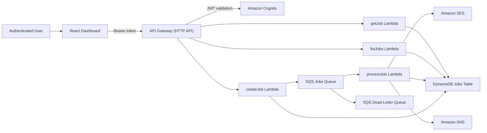

# AWS Event-Driven Job Processing System

## Genel Bakış

Bu proje, AWS üzerinde kurulmuş sunucusuz ve event-driven bir job processing sistemidir. React + TypeScript ile geliştirilmiş bir yönetim paneli ile desteklenir. Job oluşturma ve sorgulama işlemlerini senkron API çağrılarıyla, job çalıştırma sürecini ise kuyruk tabanlı asenkron bir yapı ile birleştirir. Bu yönüyle, bulut tabanlı arka plan işleme sistemlerinin nasıl tasarlanabileceğini gösteren pratik bir full-stack örnektir.

Backend tarafı Node.js, TypeScript, Serverless Framework, AWS Lambda, API Gateway, DynamoDB, SQS, SNS, SES ve Cognito kullanılarak geliştirilmiştir. Frontend tarafı ise kimlik doğrulama, job oluşturma, job listeleme, filtreleme ve job geçmişini görüntüleme gibi kullanıcı akışlarını sunar.

## Temel Özellikler

- Node.js, TypeScript, AWS Lambda ve Serverless Framework ile geliştirilmiş serverless backend
- Job oluşturma, job listeleme ve tekil job görüntüleme için HTTP API
- SQS tabanlı event-driven ve asenkron işleme akışı
- İki job tipi desteği: `demo` ve `email`
- `email` job tipi için gerçek AWS SES entegrasyonu
- Başarılı ve başarısız job sonuçları için SNS event yayını
- Job durum değişikliklerini izleyen audit/history takibi
- `status` ve `type` alanlarına göre filtreleme
- Sıralama ve `limit` desteği
- Cursor-based pagination
- Cognito ile korunan API endpoint'leri
- Kullanıcıların yalnızca kendi job'larına erişebilmesini sağlayan ownership tabanlı erişim modeli
- Backend API ile entegre React + TypeScript dashboard
- Backend test, frontend build doğrulaması ve backend deployment içeren GitHub Actions iş akışı

## Teknoloji Yığını

- Backend: Node.js, TypeScript, Serverless Framework, AWS Lambda
- API Katmanı: Amazon API Gateway HTTP API
- Veri Tabanı: Amazon DynamoDB
- Mesajlaşma: Amazon SQS ve Amazon SNS
- E-posta Gönderimi: Amazon SES
- Kimlik Yönetimi: Amazon Cognito
- Frontend: React, TypeScript, Vite, React Router
- Test: Vitest
- CI/CD: GitHub Actions, AWS OIDC, Serverless deploy

## Mimari Genel Bakış

Sistem, sorumlulukların ayrıldığı net bir yapıyla tasarlanmıştır:

- API handler'ları istekleri alır, doğrular ve uygulama akışını yönetir.
- Service katmanı queue yönetimi, job processing, auth yardımcıları, email gönderimi ve event publishing gibi işleri üstlenir.
- Repository katmanı DynamoDB erişimini merkezileştirir.
- Mapper ve validator yapısı, veri dönüştürme ve input doğrulamayı handler'lardan ayırır.
- Job oluşturma ve sorgulama istek-cevap modeliyle çalışırken, işleme hattı asenkron ve queue tabanlıdır.
- Kimlik doğrulama Cognito tarafından sağlanır, yetkilendirme ise owner kontrolleriyle uygulama mantığında yapılır.

### Mimari Diyagram



## AWS Servisleri Sistemde Nasıl Birlikte Çalışıyor?

- API Gateway, HTTP endpoint'lerini dışarı açar ve istekleri ilgili Lambda fonksiyonlarına yönlendirir.
- Cognito, korunan API route'ları için JWT tabanlı kimlik doğrulama sağlar.
- Lambda, job oluşturma, listeleme, tekil job getirme ve queue üzerinden job işleme görevlerini yürütür.
- DynamoDB, job kaydını, mevcut durumu, sonuç veya hata bilgisini, deneme sayısını ve history verisini tutar.
- SQS, job submission ile job execution süreçlerini birbirinden ayırır ve asenkron işleme hattını sağlar.
- SES, `email` job tipi için gerçek e-posta gönderiminde kullanılır.
- SNS, tamamlanan veya hata alan job'lar için event yayınlar; böylece sistem başka tüketicilere gevşek bağlı şekilde açılabilir.

## İstek Akışı / Sistem Nasıl Çalışır?

1. Kullanıcı frontend dashboard üzerinden giriş yapar ve Cognito tabanlı bir oturum elde eder.
2. Frontend, bearer token ile backend API'ye yetkili istekler gönderir.
3. API Gateway, ilgili Lambda fonksiyonunu çalıştırmadan önce token'ı Cognito authorizer ile doğrular.
4. `createJob`, payload'ı doğrular, DynamoDB'ye `pending` durumunda yeni job kaydı oluşturur, kullanıcıyı `ownerId` olarak ekler, ilk history kaydını oluşturur ve SQS'ye mesaj gönderir.
5. `processJob`, SQS tarafından tetiklenir; job hâlâ `pending` durumundaysa onu claim eder, `processing` durumuna geçirir, deneme sayısını artırır ve job tipine göre ilgili processor'ı çalıştırır.
6. İşlem başarılıysa job `completed` olarak işaretlenir, sonuç verisi kaydedilir, history güncellenir ve SNS üzerinden `job.completed` eventi yayınlanır.
7. İşlem başarısız olursa job `failed` olarak işaretlenir, hata mesajı kaydedilir, history güncellenir ve `job.failed` eventi yayınlanır.
8. SQS kuyruğu bir dead-letter queue ve `3` maksimum deneme sayısı ile tanımlandığı için sistem retry/DLQ odaklı bir işleme yapısına sahiptir.

## Backend Bileşenleri

### API Handler'ları

- `createJob`: yeni job kabul eder, isteği doğrular, job'ı kaydeder ve kuyruğa ekler
- `listJobs`: owner bazlı job listesini filtreleme, sıralama, limit ve cursor pagination ile döndürür
- `getJob`: tek bir job kaydını getirir ve mevcut kullanıcının bu job'ın sahibi olup olmadığını kontrol eder
- `processJob`: kuyruktan gelen job'ları tüketir ve uygun processor ile çalıştırır

### Repository Katmanı

- Repository katmanı DynamoDB erişimini merkezileştirir.
- Job kayıtları; durum, tip, payload, zaman damgaları, deneme sayısı ve history dizisi ile saklanır.
- Listeleme tarafında `status`, `type` ve `ownerId` filtreleri ile cursor-based pagination desteklenir.

### Service Katmanı

- Queue service, yeni oluşturulan job'ları SQS'ye yollar.
- Email service, AWS SES ile gerçek e-posta gönderir.
- Event publisher, job sonuç event'lerini SNS'e yayınlar.
- Authentication helper, request context içinden Cognito kullanıcı kimliğini çıkarır.
- Processor registry, job tiplerini ilgili işleme fonksiyonlarına bağlar.

### Validator ve Mapper Yapısı

- Request validator'ları desteklenen job tiplerini ve payload yapısını doğrular.
- Response mapper, `ownerId` gibi internal alanların API response modeline taşınmamasını sağlar.

## Frontend Genel Bakış

Frontend, sistemin kullanıcıya açık yönetim panelidir. Yalnızca API'yi gösteren basit bir arayüz değil; giriş yapma, job oluşturma, job listeleme ve işleme geçmişini izleme gibi gerçek kullanıcı akışlarını destekleyen bir dashboard'dur.

- Giriş ekranı
- Korunan route yapısı
- Filtreleme, sıralama, limit ve sonraki sayfa desteği olan jobs dashboard
- `demo` ve `email` job oluşturma ekranı
- Metadata, result, error ve history timeline gösteren job detail ekranı
- Mevcut bearer token ile backend'e bağlanan API client katmanı

### Frontend Dashboard'un Sistemdeki Rolü

Dashboard, sistemin operasyonel görünümünü sağlar. Kullanıcılar bu arayüz üzerinden backend'e iş gönderebilir, asenkron çalışan job'ların durumunu takip edebilir ve bir job'ın zaman içinde hangi aşamalardan geçtiğini doğrudan görebilir.

## Kimlik Doğrulama ve Yetkilendirme

Bu proje, authentication ile authorization kavramlarını ayrı ele alır:

- Authentication: "Kullanıcı kim?"
- Authorization: "Bu kullanıcının neye erişim izni var?"

Bu sistemde:

- Cognito kimlik doğrulamayı üstlenir ve API Gateway, korunan endpoint'lere gelen JWT'leri doğrular.
- Backend, doğrulanmış kullanıcının `sub` claim değerini mevcut kullanıcı kimliği olarak kullanır.
- Yeni oluşturulan her job bir `ownerId` ile kaydedilir.
- `GET /jobs` yalnızca o kullanıcıya ait job'ları döndürür.
- `GET /jobs/{id}` endpoint'i ownership kontrolü yapar ve kullanıcı farklı bir job'a erişmeye çalışırsa `403` döndürür.

Bu yaklaşım, portföy projesi için hem gerçekçi hem de anlaşılır bir güvenlik modeli sunar: kimlik Cognito tarafından sağlanır, veri erişim kuralları ise backend kodunda uygulanır.

## Job Yaşam Döngüsü

Job'lar küçük ama net bir yaşam döngüsünden geçer:

- `pending`: job oluşturulmuş, kaydedilmiş ve kuyruğa eklenmiştir
- `processing`: worker job'ı claim etmiş ve işlemeye başlamıştır
- `completed`: job başarıyla tamamlanmış ve result kaydedilmiştir
- `failed`: job hata ile sonlanmış ve hata bilgisi kaydedilmiştir

Her durum değişikliği, zaman damgası ve isteğe bağlı metadata ile birlikte `history` dizisine eklenir. Böylece hem backend response modelinde hem de frontend timeline görünümünde izlenebilir bir audit trail oluşur.

Şu anda iki job tipi uygulanmıştır:

- `demo`: asenkron akışı test etmek için basit bir processor
- `email`: payload doğrulaması yapan ve AWS SES ile e-posta gönderen processor

## Örnek API Endpoint'leri

Mevcut API yüzeyi:

- `POST /jobs`
- `GET /jobs`
- `GET /jobs/{id}`

### Demo job oluşturma

```bash
curl -X POST "<API_BASE_URL>/jobs" \
  -H "Authorization: Bearer <COGNITO_JWT>" \
  -H "Content-Type: application/json" \
  -d '{
    "type": "demo",
    "payload": {
      "task": "sample"
    }
  }'
```

Örnek response:

```json
{
  "id": "9fa3d3a7-7b27-4f89-9f01-2e1c81d5c6f7",
  "status": "pending"
}
```

### Email job oluşturma

```bash
curl -X POST "<API_BASE_URL>/jobs" \
  -H "Authorization: Bearer <COGNITO_JWT>" \
  -H "Content-Type: application/json" \
  -d '{
    "type": "email",
    "payload": {
      "to": "user@example.com",
      "subject": "Welcome",
      "body": "Your background job was created successfully."
    }
  }'
```

### Filtreleme, sıralama ve pagination ile job listeleme

```bash
curl "<API_BASE_URL>/jobs?status=completed&type=email&sortOrder=desc&limit=10&cursor=<ENCODED_CURSOR>" \
  -H "Authorization: Bearer <COGNITO_JWT>"
```

Örnek response:

```json
{
  "items": [
    {
      "id": "9fa3d3a7-7b27-4f89-9f01-2e1c81d5c6f7",
      "type": "email",
      "status": "completed",
      "attemptCount": 1,
      "createdAt": "2026-04-08T10:15:00.000Z",
      "updatedAt": "2026-04-08T10:15:04.000Z",
      "history": [
        {
          "eventType": "status_change",
          "status": "pending",
          "timestamp": "2026-04-08T10:15:00.000Z"
        },
        {
          "eventType": "status_change",
          "status": "processing",
          "timestamp": "2026-04-08T10:15:02.000Z",
          "metadata": {
            "attemptCount": 1
          }
        },
        {
          "eventType": "status_change",
          "status": "completed",
          "timestamp": "2026-04-08T10:15:04.000Z",
          "message": "Email job processed successfully",
          "metadata": {
            "jobType": "email"
          }
        }
      ],
      "result": {
        "message": "Email job processed successfully",
        "processedAt": "2026-04-08T10:15:04.000Z",
        "recipient": "user@example.com",
        "messageId": "example-message-id",
        "subject": "Welcome"
      }
    }
  ],
  "nextCursor": "..."
}
```

### Tek bir job getirme

```bash
curl "<API_BASE_URL>/jobs/9fa3d3a7-7b27-4f89-9f01-2e1c81d5c6f7" \
  -H "Authorization: Bearer <COGNITO_JWT>"
```

## Ortam ve Konfigürasyon

Proje, backend tarafında Serverless yapılandırması ve frontend tarafında environment variable'lar ile çalışır.

### Backend Konfigürasyonu

Backend altyapısı ve runtime bağlantılarının büyük bölümü `serverless.yml` içinde tanımlanmıştır. Deploy edilen yapıda özellikle şu değerler önemlidir:

- `JOBS_TABLE_NAME`: job kayıtlarının tutulduğu DynamoDB tablosu
- `JOBS_QUEUE_URL`: yeni job oluşturulduğunda mesaj gönderilen SQS queue URL'i
- `JOB_EVENTS_TOPIC_ARN`: job başarı/hata event'leri için SNS topic ARN'i
- `SES_FROM_EMAIL`: email job'ları için gönderen adres
- AWS region ve credentials: deployment ve servis erişimi için gereklidir
- Cognito user pool ve app client ayarları: API Gateway authorizer yapılandırmasında kullanılır

### Frontend Konfigürasyonu

Örnek frontend `.env` değerleri:

```bash
VITE_APP_TITLE=Job System Admin
VITE_API_BASE_URL=https://your-api-id.execute-api.eu-central-1.amazonaws.com/
VITE_AUTH_MODE=cognito
VITE_COGNITO_REGION=eu-central-1
VITE_COGNITO_USER_POOL_ID=your-user-pool-id
VITE_COGNITO_CLIENT_ID=your-app-client-id
```

Bu değerlerin kullanım amaçları:

- `VITE_API_BASE_URL`: backend API'nin temel adresi
- `VITE_APP_TITLE`: dashboard içinde gösterilen uygulama başlığı
- `VITE_AUTH_MODE`: tarayıcı üzerinden giriş için `cognito`, token ile test için `manual`
- `VITE_COGNITO_REGION`: browser auth akışında kullanılan Cognito bölgesi
- `VITE_COGNITO_USER_POOL_ID`: frontend config içinde tutulan user pool kimliği
- `VITE_COGNITO_CLIENT_ID`: Cognito authentication için kullanılan app client kimliği

## Lokal Geliştirme

### Bağımlılıkları Kurma

Backend:

```bash
npm install
```

Frontend:

```bash
cd frontend
npm install
```

### Backend Testlerini Çalıştırma

```bash
npm test
```

### Frontend Dashboard'u Başlatma

```bash
cd frontend
npm run dev
```

### Lokal Geliştirme Notları

- Frontend, gerekli environment değişkenleri tanımlandığında Vite ile lokal olarak çalıştırılabilir.
- Mevcut repository içinde API Gateway, SQS, Lambda ve DynamoDB için tam kapsamlı bir offline emülasyon kurulumu bulunmamaktadır.
- Gerçek uçtan uca backend akışı için AWS kaynaklarının oluşturulmuş olması ve backend'in Serverless ile deploy edilmesi gerekir.
- Cognito browser sign-in henüz hazır değilse frontend, lokal test için manual token modunu da destekler.

## CI/CD

Repository içinde hem continuous integration hem de backend deployment sürecini kapsayan bir GitHub Actions iş akışı bulunmaktadır.

### CI İş Akışı

Push ve pull request durumlarında GitHub Actions:

- repository'yi checkout eder
- backend bağımlılıklarını kurar ve Vitest testlerini çalıştırır
- frontend bağımlılıklarını kurar ve production build alır

Bu yapı, backend mantığı için hızlı geri bildirim sağlar ve frontend'in derlenebilir durumda kaldığını doğrular.

### CD İş Akışı

`main` branch'ine push geldiğinde, backend testleri ve frontend build başarılı olduktan sonra GitHub Actions:

- AWS credentials yapılandırmasını GitHub OIDC ile yapar
- deployment için bir AWS IAM role üstlenir
- backend bağımlılıklarını kurar
- `npx serverless deploy` komutunu çalıştırır

Böylece uzun ömürlü AWS access key'lerini repository içinde tutmadan backend deployment otomatik hale gelir. Mevcut iş akışı backend stack'ini deploy eder; frontend hosting deployment adımı şu anda dahil değildir.

## Bu Proje Neden Değerli?

Bu proje, basit bir CRUD API örneğinin ötesine geçer. API tasarımı, asenkron işleme, bulut altyapısı, güvenlik ve frontend entegrasyonunu tek bir sistem içinde birleştirerek daha gerçekçi bir mühendislik çalışması ortaya koyar.

### Kazanımlar / Öğrenme Çıktıları

- Yalnızca senkron istek işlemek yerine event-driven bir akış tasarlamak
- Handler, service, repository, validator ve mapper ayrımı ile serverless backend kurgulamak
- Authentication ve authorization farkını çalışan bir sistemde uygulamak
- Ownership tabanlı veri erişim kontrolü geliştirmek
- Birden fazla AWS servisini tek uygulama akışında entegre etmek
- Tip güvenli bir frontend dashboard'u authenticated backend API ile birleştirmek
- GitHub Actions ve AWS OIDC ile doğrulama ve deployment süreçlerini otomatikleştirmek

## Gelecekte Yapılabilecek Geliştirmeler

- Scan tabanlı listelemeyi, daha uygun DynamoDB query pattern'leri ve index'lerle geliştirmek
- Daha fazla job tipi ve daha güçlü job-type bazlı payload şemaları eklemek
- Metric, tracing ve alerting ile gözlemlenebilirlik katmanını güçlendirmek
- Deploy edilmiş altyapı için uçtan uca entegrasyon testleri eklemek
- Backend deployment'a ek olarak frontend deployment pipeline'ı oluşturmak
- Retry kontrolü, cancellation veya event consumer'lar gibi daha gelişmiş operasyonel özellikler eklemek

## Proje Özeti

- React dashboard ile desteklenen full-stack AWS serverless proje
- Cognito korumalı API ve ownership tabanlı authorization yaklaşımı
- Lambda, SQS, DynamoDB, SNS ve SES ile kurulu asenkron job processing hattı
- Job history takibi, durum geçişleri, filtreleme, sıralama ve cursor pagination desteği
- GitHub Actions CI ve OIDC tabanlı Serverless backend deployment süreci
